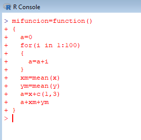
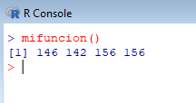
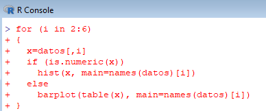
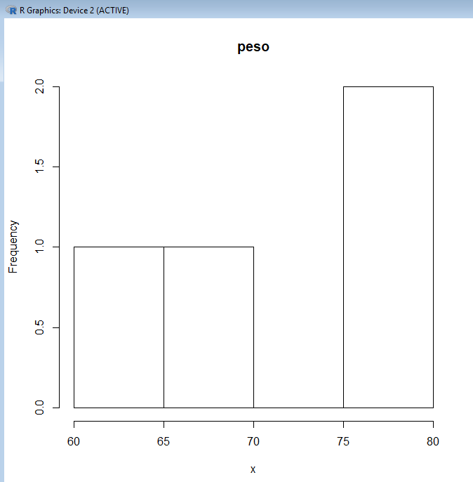

___

# **Bucles.**

---

Las estructuras de for y if/else se conocen en programación como estructuras de control. Hay bucles whiles y otro tipos de estructuras.

---

## **For.**

Vamos a crear el bucle for, por ejemplo, con la siguiente función.

`mifuncion=function()
{
  a=0
  for(i in 1:100)
  {
    a=a+i
  }
  xm=mean(x)
  ym=mean(y)
  a=x+c(1,3)
  a+xm+ym
}`

---

## **If/Else.**

Para hacer una estructura condicional con un gráfico, con if y else, para ello hacemos lo siguiente.

`for (i in 2:6)
{
  x=datos[,i]
  if (is.numeric(x))
    hist(x, main=names(datos)[i])
  else
    barplot(table(x), main=names(datos)[i])
}`

---
