___

# **Gráficos Y Matrices.**

---

## **Gráficos.**

El comando `curve(x^2, from=-3, to=3)` permite hacer gráficos de funciones.

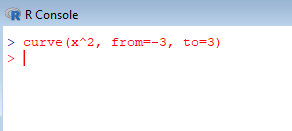

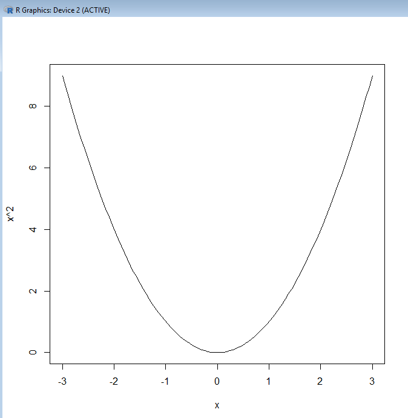

También podemos hacer `curve(sin, from=-2*pi, to=2*pi)`.

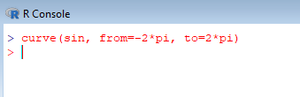

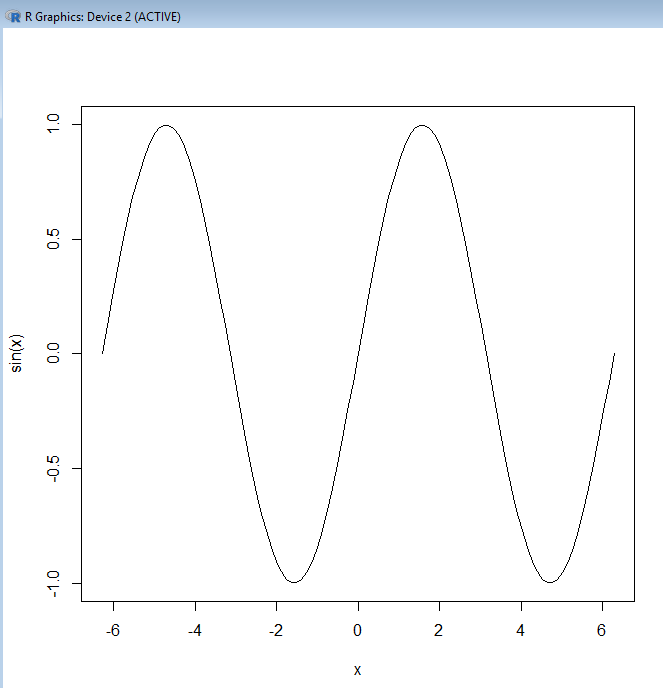

En R constantes están grabadas, por ejemplo, `pi`.

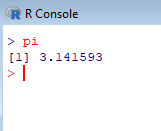

En el `curve()` también podemos poner la tangente que es `tan`.

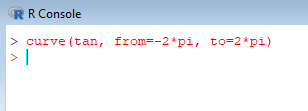

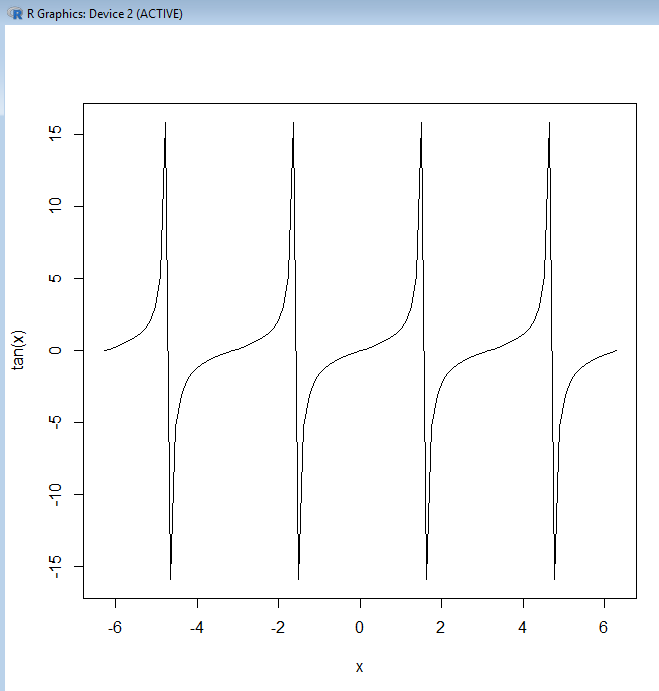

Podemos asignar valores a la secuencia y a la operación que queremos realizar y luego hacemos el gráfico pero en este caso sería `plot(y~x)`, pero en este caso con puntos.

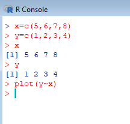

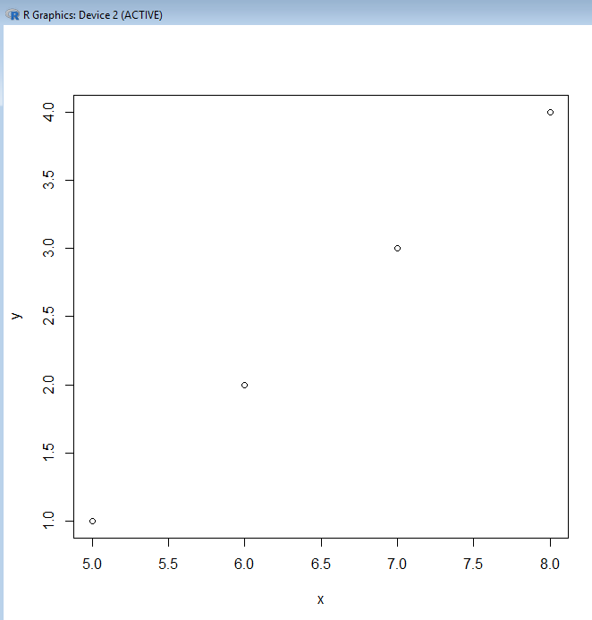

Si ponemos `plot(y~x, type="l")` y nos pone una línea.

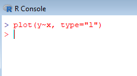

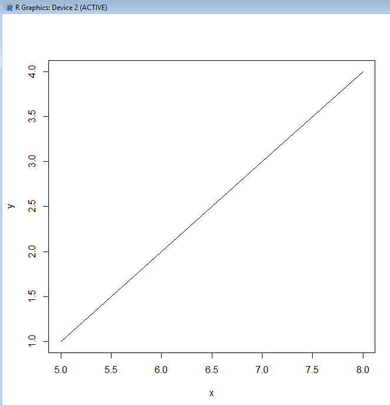

En los gráficos `p` equivale a puntos y `l` equivale a líneas, aunque por defecto nos coge `p`.

Para hacer que la fórmula aparezca en la gráfica ponemos `text(0.5,6,expression(formulamatematica))`.

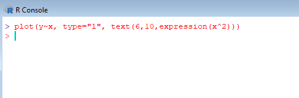

También podemos poner letras griegas si dentro de la expresión ponemos su nombre, por ejemplo, `alpha`, `beta`,...

En el modelo de la reducción logística podemos ver algo como lo siguiente `curve(plogis, from=-3, to=3)`.

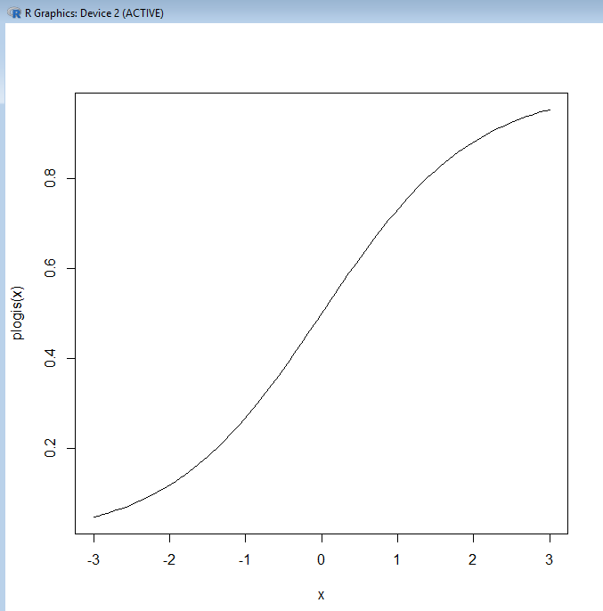

Si ponemos `?plotmath` podemos ver todas las funciones que pueden ponerse en un `plot`.

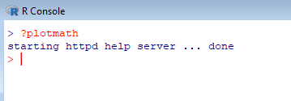

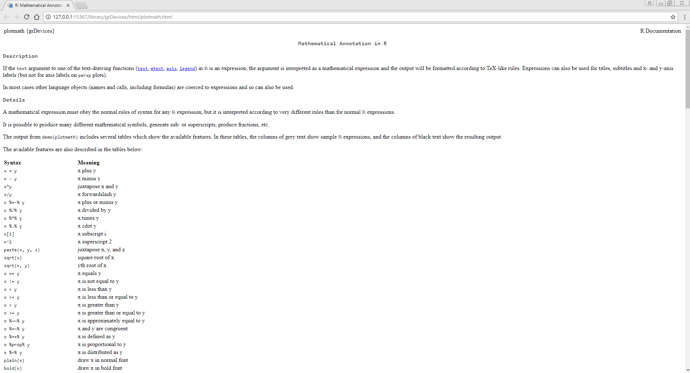

---

## **Matrices.**

Entre el data frame y las matrices hay una diferencia, el data frame se graba como una lista, no es atómico pero sus datos dentro del data frame pueden ser atómicos. Dentro de sus variables pueden meterse caracteres como números. Las matrices son atómicas.

Para hacer matrices utilizamos el comando `matrix(c(1,2,3),c(4,5,6),c(7,8,9))` o `matrix(1:9)`, en el segundo caso queda como una columna de nueve filas, para conseguir tres columnas ponemos `matrix(1:9, ncol=3)` y ya es una matriz de 3x3.

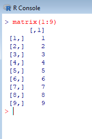

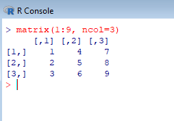

Todos los elementos de una matriz tiene que ser del mismo tipo, todos numéricos o todos caracteres.

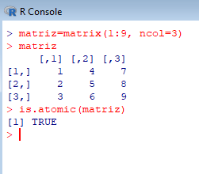

La matriz es un vector con ciertas características especiales, para verlo como filas y columnas.

Para ver la segunda fila se pone `matriz[2,]` y para ver la tercera columna se pone `matriz[,3]`.

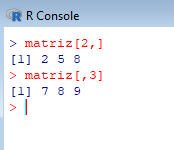

También podemos ver un elemento en concreto con `matriz[2,3]` y iría al elemento de la fila 2 y columna 3.

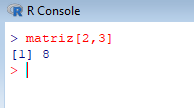

También podemos poner una matriz sin una fila poniendo `matriz[-1,]` y nos quita la fila 1.

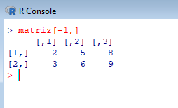

Podemos hacer lo siguiente `apply(matriz,1,mean)` y esto nos hace a la matriz a por filas la media.

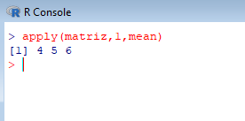

A parte de las matrices también podemos hablar de arreglos, las matrices son vectores almacenados por columnas, para saber la estructura de una matriz ponemos `str(matriz)` y nos sale.

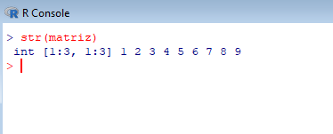

Para saber los atributos de una matriz ponemos `attributes(matriz)` y nos sale un atributo dim con la dimensión.

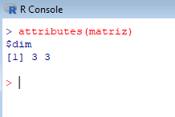

También poniendo `dim(matriz)` nos sale la dimensión de la matriz.

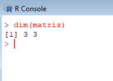

---

## **Otros Gráficos.**

Cuando tenemos variables categóricas tenemos que hacer gráfico de barras y hay que utilizar el comando `barplot(table(datos$ojos))`.

Cuando tenemos variables numéricas tenemos que hacer un histograma y hay que utilizar el comando `hist(x)`.

Hemos visto el comando `plot()`, `text()`, `legend()`, `barplot()`, `boxplot()`.

El `plot()`, el `barplot()` y el `boxplot()` son ejemplos de lo que se conoce como comandos de gráficos de alto nivel, porque estos comandos crean gráficos.

El `text()` y el `legend()` modifican el gráfico actual para añadir una legenda, para añadir un texto o para una cosa similar.

Ahora vamos a hacer un gráfico de tres dimensiones.

Para esto utilizaremos la base de datos `mtcars`.

Lo primero que hacemos es el siguiente gráfico, `plot(mpg~wt, data=mtcars)`, con esto podemos ver la relación que hay entre las variables.

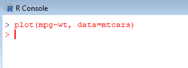

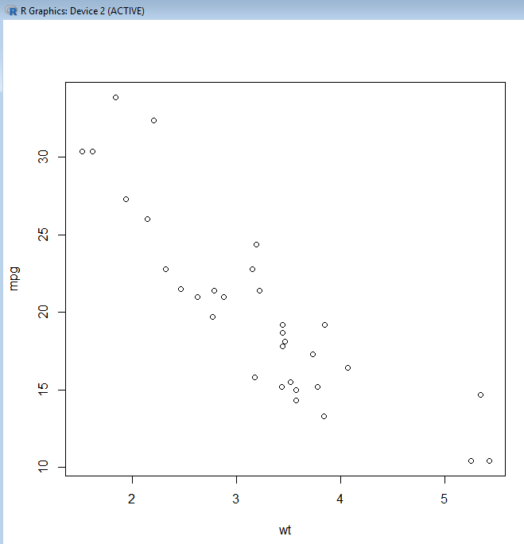

Ahora si hacemos `plot(mpg~hp, data=mtcars)` y veremos denuevo la relación que tienen las variables.

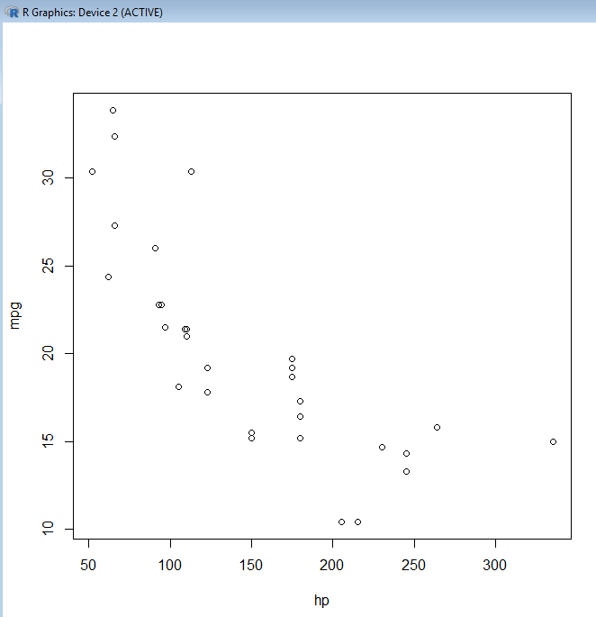

También podemos hacer lo siguiente `plot(mpg~cyl, data=mtcars)` y seguiriamos viendo una gráfico con la relación de variables.

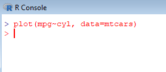

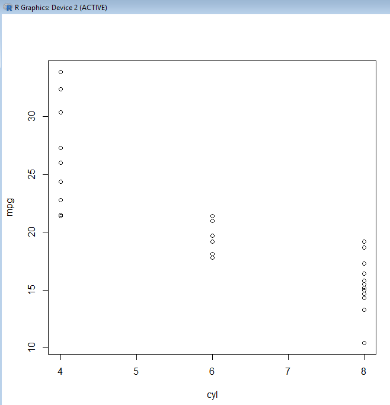

Y también con la siguiente `plot(wt~cyl, data=mtcars)` se vería como en las otras la relación entre las variables.

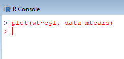

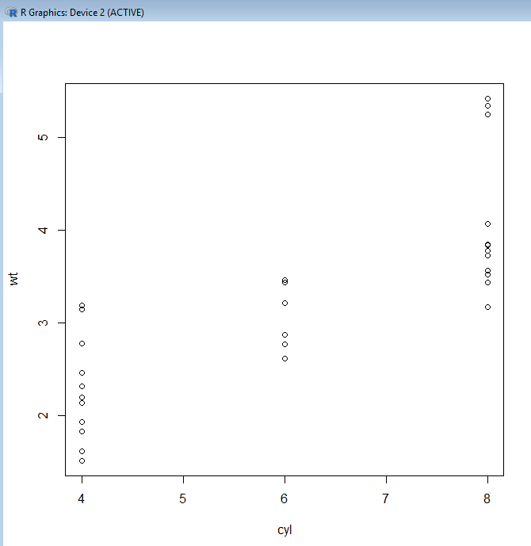

Y con la siguiente `plot(wt~hp, data=mtcars)` se ve la relación entre variables.

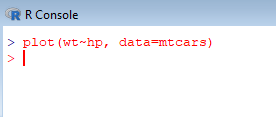

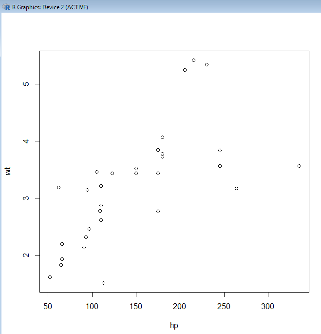

Y con la siguiente `plot(hp~wt, data=mtcars)` se ve la relación entre variables.

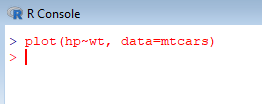

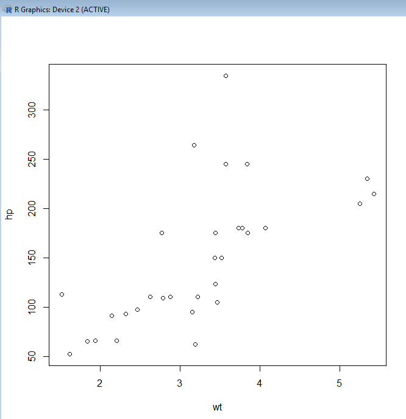

Ahora vamos a hacer un gráfico de tres dimensiones utilizando `plot3d(mtcars$wt,mtcars$hp,mtcars$mpg)`.

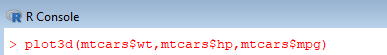

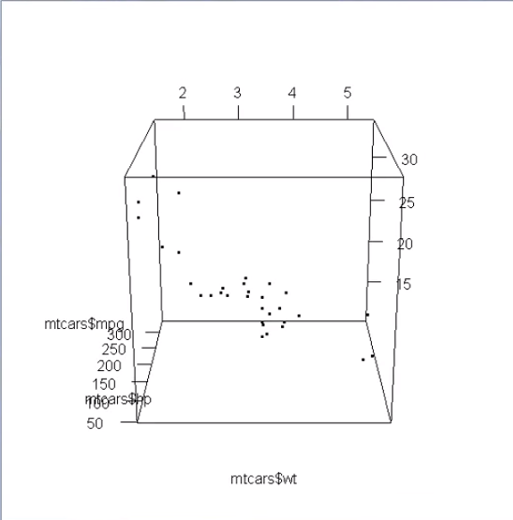

Ahora crearemos la función f como `f=function(x,y) exp(-(x^2+y^2))`.

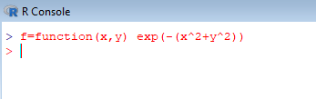

Luego creamos x e y como se ve a continuación.

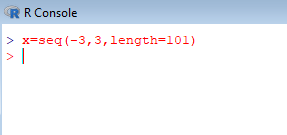

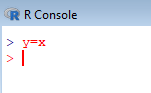

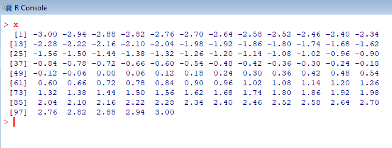

Luego creamos z con respecto de los valores x e y, y también respecto la función f.

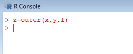

El valor de z sería el siguiente.

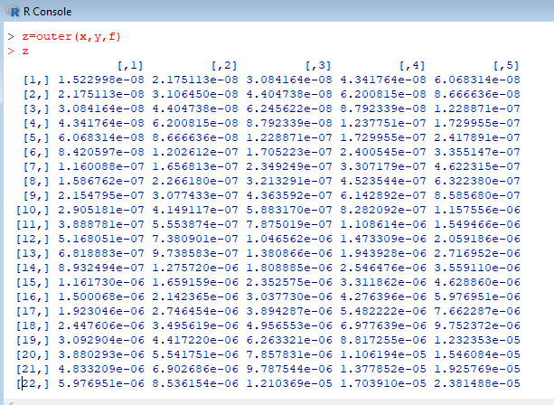

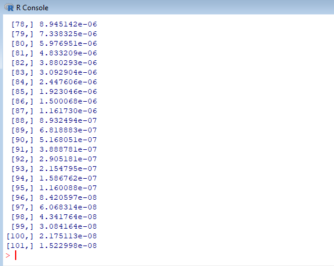

Luego realizamos un gráfico en tres dimensiones con los datos anteriormente calculados y con el comando `persp3d(x,y,z, front="line", back="line")`.

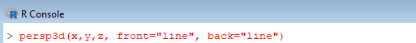

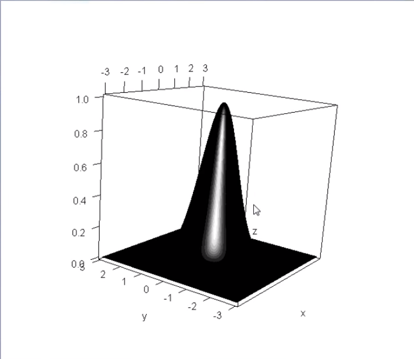

Ahora hacemos otra gráfica para ver el contorno de la gráfica anterior para ello utilizamos `contour(x,y,z)`

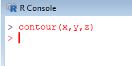

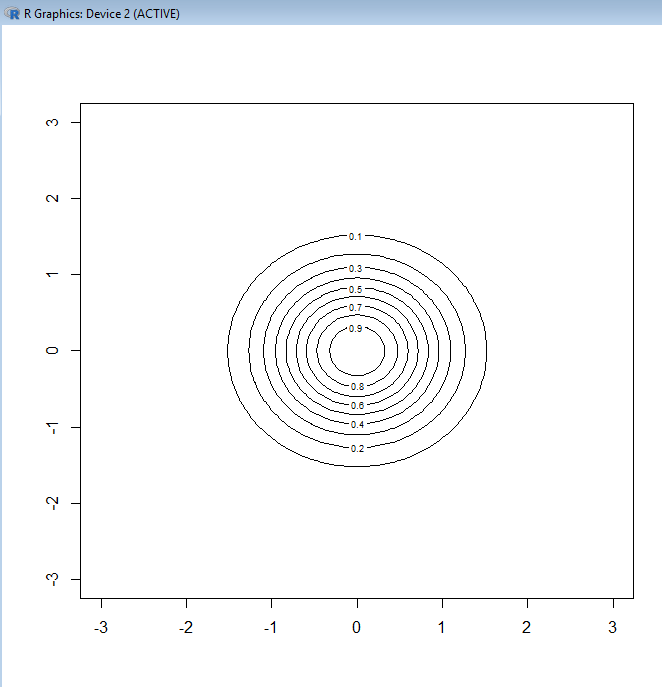

También podemos utilizar el comando `image(x,y,z)` y se vería como a continuación.

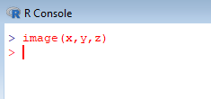

También podemos hacer lo anterior pero cambiandole el color utilizando `image(x,y,z,col=terrain.colors(20))`.

También poniendo otro nombre de la asignacción nos coge otro tipo de colores `image(x,y,z,col=topo.colors(20))`.

También podemos hacer gráficos con elipses como se ve `ploted(ellipse3d(diag(3)))`.

Ahora volveremos a hacer un gráfico con elipses con el comando `ploted(ellipse3d(diag(3)),front="line",back="line")`.

Ahora haremos otra gráfico diferente con el comando `ts.plot(BJsales)`.

Lo volvemos a hacer pero con otra variable.

Esta variable anteriormente utilizada `AirPassengers` son los pasajeros que se han tenido cada mes de los distintos años que salen en la tabla.

Creamos una variable respecto la variable anteriormente nombrada.

Hacemos una predicción en los próximos 12 meses con respecto al modelo que se creo.

Hacemos un gráfico con la predicción de esos 12 meses.

A continuación se puede ver los parametros para poder hacer la predicción.

Volvemos a hacer un `plot(mtcars$wt)`.

Ahora hacemos `ts.plot(mtcars$wt)`.

Ahora cogemos una variable con una secuencia `x=seq(0,2,length=21)`.

Ahora creamos otra variables `y1`,`y2` e `y3`, y luego hacemos una combinación de todas ellas en la variable y.

Con todo esto utilizamos el comando `matplot(x,y,type="l")`, y nos crea una gráfica con las tres variables creada anteriormente que se combinaron en y.

Ahora le ponemos una leyenda y nos aparecera en la gráfica.

A continuación se puede ver un ejemplo más completo de las gráficas en tres dimensiones.

## **Detalles De Los Gráficos.**

Ahora vamos a ver como hacer pequeños cambios a los gráficos.

Lo que hacemos es lo siguiente `plot(mpg~wt, data=mtcars)`. En este gráfico podemos ver la relación que existen entre las dos variables.

Ahora haremos lo siguiente `plot(mpg~wt, data=mtcars, xlab="Peso", ylab="Millas Por Galon", main="Eficiencia", sub="Datos")`, y esto serían las etiquetas para cada eje, un título y un subtitulo.

Otro data frame que hay en R es `names(iris)` o `View(iris)` para ver el contenido.

Creamos otro gráfico como el siguiente `plot(Sepal.Length~Sepal.Width, data=iris)` aqui se ve la relación entre las dos variables.

`plot(Sepal.Length~Sepal.Width, data=iris, col=Species)` esto pone un color distinto para cada especie.

`plot(Sepal.Length~Sepal.Width, data=iris, col=Species, pch=as.numeric(Species))` también ponemos ponerle el segun la diferencia de caracteres una forma distinta con el que trabajamos en el gráfico, `pch` no acepta factores y entonces hacemos lo anterior. Al ponerle `as.numeric` cambia el nombre de la especie por un número.

Ponemos `?points` y nos saldrá la ayuda para saber los puntos distintos que hay para poner en los `plots` y sobre el `pch`.

Si ponemos `legend` despues del `plot` como `legend("topleft", levels(iris$Species), col=1:3, pch=1:3)` nos pone como legenda.

Para resumir el nombre de las especies en la legenda ponemos
`plot(Sepal.Length~Sepal.Width, data=iris, col=Species, pch=c("s","v","i")[as.numeric(Species)])
legend("topleft", levels(iris$Species), col=1:3, pch=c("s","v","i"))` y nos cambia la simbologia por lo que pusimos, es decir, s,v e y.

---
