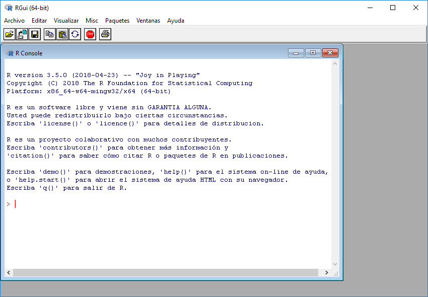
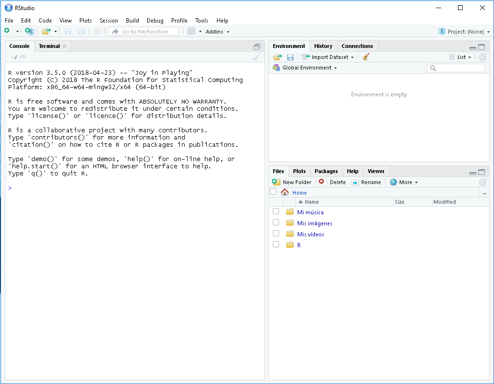

___

# **Lenguaje De Programación R.**

---

## **Introducción.**

R es un entorno y lenguaje de programación con un enfoque al análisis estadístico.

R es una implementación de software libre del lenguaje S pero con soporte de alcance estático. Se trata de uno de los lenguajes más utilizados en investigación por la comunidad estadística, siendo además muy popular en el campo de la minería de datos, la investigación biomédica, la bioinformática y las matemáticas financieras. A esto contribuye la posibilidad de cargar diferentes bibliotecas o paquetes con funcionalidades de cálculo y gráficas.

R es parte del sistema GNU y se distribuye bajo la licencia GNU GPL. Está disponible para los sistemas operativos Windows, Macintosh, Unix y GNU/Linux.

---

## **Características.**

R proporciona un amplio abanico de herramientas estadísticas (modelos lineales y no lineales, tests estadísticos, análisis de series temporales, algoritmos de clasificación y agrupamiento, etc.) y gráficas.

Al igual que S, se trata de un lenguaje de programación, lo que permite que los usuarios lo extiendan definiendo sus propias funciones. De hecho, gran parte de las funciones de R están escritas en el mismo R, aunque para algoritmos computacionalmente exigentes es posible desarrollar bibliotecas en C, C++ o Fortran que se cargan dinámicamente. Los usuarios más avanzados pueden también manipular los objetos de R directamente desde código desarrollado en C. R también puede extenderse a través de paquetes desarrollados por su comunidad de usuarios.

R hereda de S su orientación a objetos. La tarea de extender R se ve facilitada por su permisiva política de lexical scoping, alcance léxico.​

Además, R puede integrarse con distintas bases de datos y existen bibliotecas que facilitan su utilización desde lenguajes de programación interpretados como Perl y Python.

Otra de las características de R es su capacidad gráfica, que permite generar gráficos con alta calidad. R posee su propio formato para la documentación basado en LaTeX.

R también puede usarse como herramienta de cálculo numérico, campo en el que puede ser tan eficaz como otras herramientas específicas tales como GNU Octave y su equivalente comercial, MATLAB.​ Se ha desarrollado una interfaz, RWeka​ para interactuar con Weka que permite leer y escribir ficheros en el formato arff y enriquecer R con los algoritmos de minería de datos de dicha plataforma.

---

## **Extensiones Y Paquetes.**

R forma parte de un proyecto colaborativo y abierto. Sus usuarios pueden publicar paquetes que extienden su configuración básica. Existe un repositorio oficial de paquetes cuyo número superó en otoño de 2009 la cifra de los 2000.

Dado el enorme número de nuevos paquetes, estos se han organizado en vistas (o temas), que permiten agruparlos según su naturaleza y función. Por ejemplo, hay grupos de paquetes relacionados con estadística bayesiana, econometría, series temporales, etc.

Para facilitar el desarrollo de nuevos paquetes, se ha puesto a servicio de la comunidad una forja de desarrollo que facilita las tareas relativas a dicho proceso.

Otros sistemas de software comerciales que integran con R incluyen: JMP,​ Mathematica,​ MATLAB,​ Spotfire,​ SPSS,​ Statistica,​ Platform Symphony,​ SAS,​ Tableau Software,​ Esri ArcGis,​ Dundas,​ Statgraphics​ y SQL Server 2017.​

---

## **Compiladores.**

R tiene varios compiladores pero los que más se utilizan son RGui y RStudio. Estos compiladores se encuentran en las siguientes páginas. `https://ftp.cixug.es/CRAN/` y `https://www.rstudio.com/products/rstudio/download/`.

Los compiladores de R son totalmente gratuitos, tanto el RGui como el Rstudio, ya que ambos son software libre.

* RGui.

* RStudio.

---
