___

# **Nociones Básicas De R.**

---

Para editar el tamaño de la consola vamos al Menú -> Editar -> Preferencias de la interface gráfica.

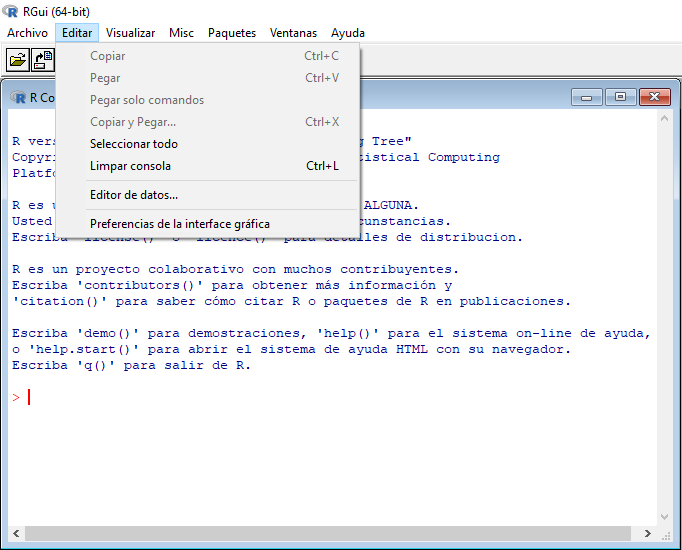

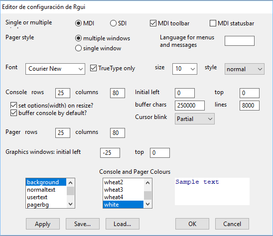

Para ver los manuales de R solo tenemos que ir al Menú -> Ayuda -> Manuales (En PDF).

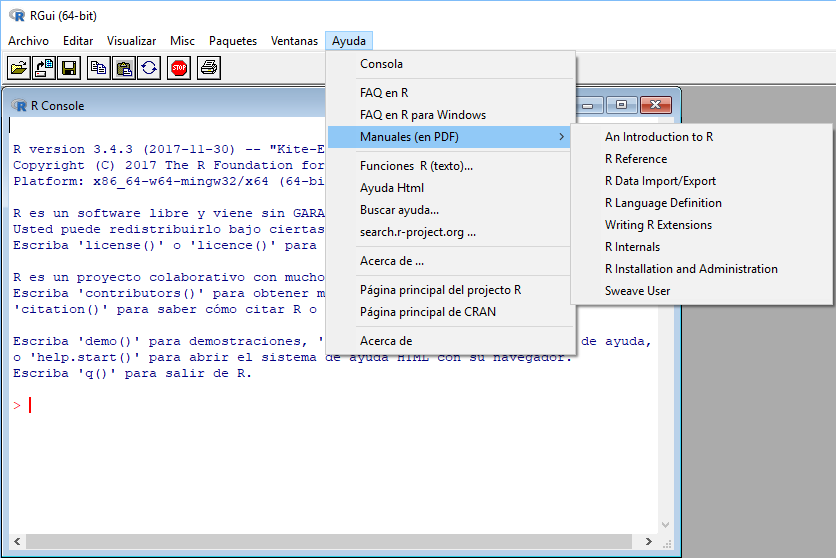

Si pinchamos Control + L se limpia la consola.

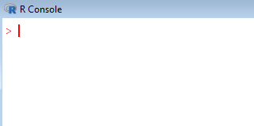

Lo primero que vamos a hacer es crear las variables. Las variables pueden llevar letras, números, puntos y barras bajas.

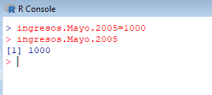

Las minúsculas y las mayúsculas son diferentes, a eso se le llama case sensitivity.

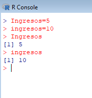

Estas variables no tienen límite de tamaño o bytes los nombres de las variables, en versiones anteriores de R si tenían un límite.

Las variables pueden empezar con punto pero las variables que empiezan con punto son las variables del sistema.

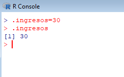

Las variables no pueden empezar con números.

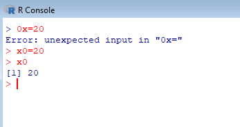

Si utilizamos `mode(nombredevariable)` nos dice que tipo de variable es.

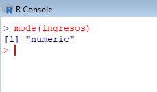

Los `mode(nombredevariable)` pueden ser numéricos, caracteres, logical, lista.

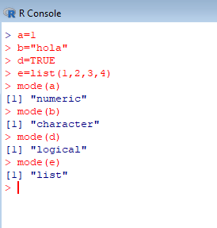

Las variables numéricas pueden ser enteros o númericas reales como precisión sencilla o como precisión doble, para comprobar esto utilizamos el comando `storage.mode(nombredevariable)`.

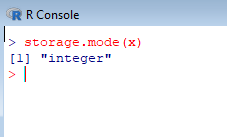

El storage mode de una variable carácter es carácter.

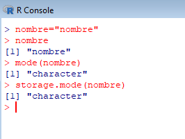

Los `storage.mode(nombredevariable)` pueden ser logical, doble, simple, entero, cáracter, lista,...

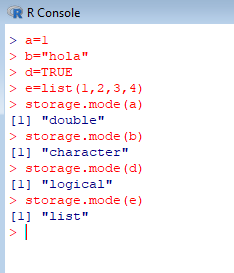

Todas las variables tiene que estar definidas con algún valor. El tipo de la variable se define automáticamente.

Para saber las variables que he creado se utiliza `ls()`.

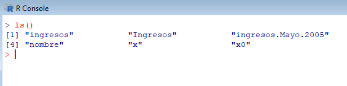

Para ver la historia de los comandos que se han utilizado, se utiliza el comando `history()`.

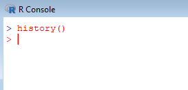

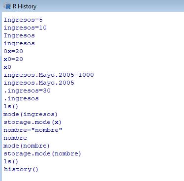

Para obtener ayuda sobre un comando utilizo el comando `?nombredecomando`, se abre una ventana de un navegador y no es necesario tener Internet porque es una página web local.

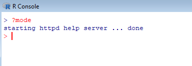

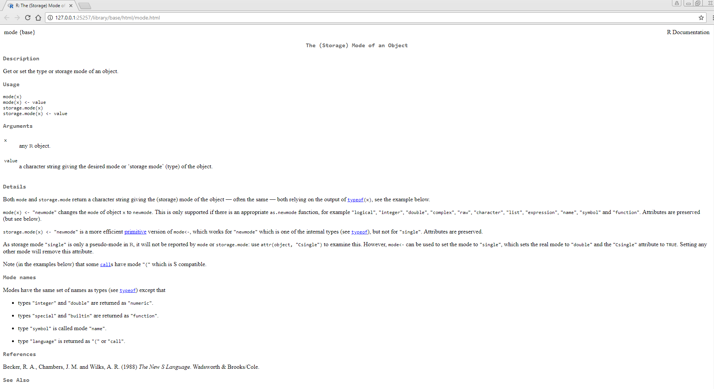

En la ayuda nos pueden salir funciones relacionadas.

Para poner comentarios utilizamos el símbolo `#`.

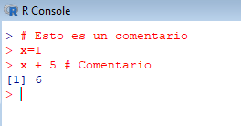

Para salir de R simplemente ponemos q() y salimos.

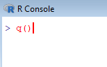

---
