___

# **Operaciones E Infinitos.**

---

Para hacer cálculos simplemente se escribe la expresión que deseemos calcular.

Los cálculos se hacen por el orden de operaciones. Si hay varias operaciones iguales se hace primero la que aparece primero.

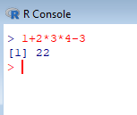

Existen los operadores + , - , * , / , ^ , %% y %/%.

Si queremos ayuda de un operador lo ponemos entre comillas dobles.

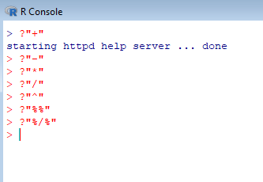

^ es elevado a un número, es decir, exponente. %% es el módulo, es decir, el resto. %/% es la división entera.

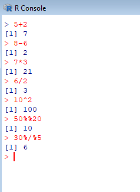

Si se hace una división entre cero nos da infinito, también esta menos infinito.

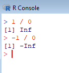

Si se hace la división cero entre cero nos da Nan, es decir, indeterminada.

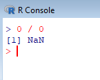

Un número dividido entre infinito (positivo o negativo) nos da cero, esto lo hace de forma teórica.

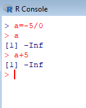

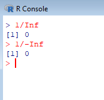

Infinito menos infinito nos da indeterminado.

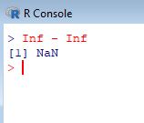

Sigue todas las reglas de las matemáticas para el infinito.

Infinito por cero da indeterminada.

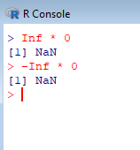

Si queremos asignar varias variables utilizamos el punto y coma para separar las variables (;).

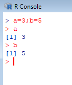

La letra c es un comando así que no se puede utilizar como variable.

Para agrupar comandos utilizamos las llaves, {}, al cerrar las llaves se ejecuta automáticamente.

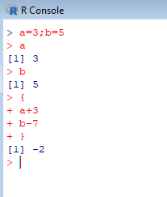

Pero si hacemos varias operaciones con las llaves solo se hará la última operación.

Si quiero que se muestren las demás operaciones dentro de las llaves utilizamos `print(expresión)`.

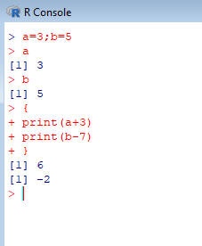

Lo anterior se hace cuando estamos dentro de un bloque de comandos con las llaves.

Si tenemos '+' es que la línea no ha terminado.

Si queremos borrar variables utilizamos `rm(nombredevariable)`.

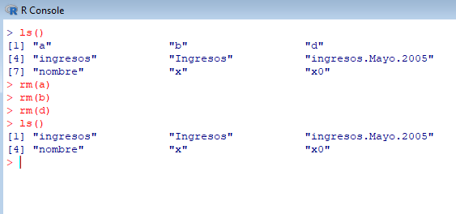

Si queremos borrar varias variables las introducimos separadas por comas.

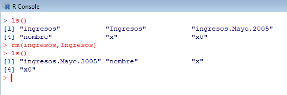

Si queremos borrar todas las variables utilizamos `rm(list=ls())`.

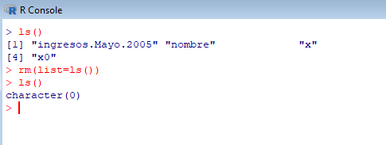

Memoria vacía = character(0).

---
