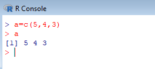
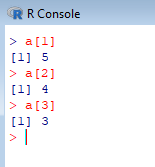
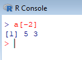
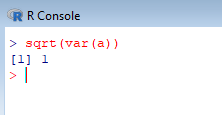
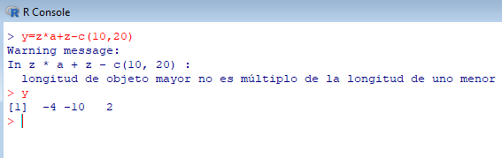
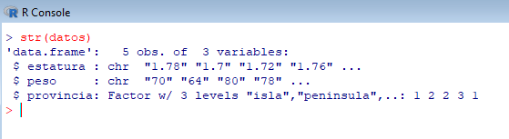
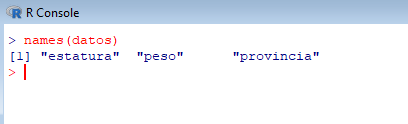

___

# **Vectores, Listas Y Data Frame.**

---

## **Vectores Y Listas.**

La variable que graba varios números es un vector.

Para grabar varios números utilizamos el comando `c` (combine) y los separamos por comas, por ejemplo, `a=c(5,4,3)`.

Para la zona decimal se separa con el punto.

Podemos hacer combinaciones de los dos anteriores.

`c` siempre es para combinar varios datos y no sirve para uno solo.

Si miramos el modo de cualquiera de estas tres variables tiene que darnos numérico.

Para ver la longitud de los vectores utilizamos el comando `length(nombredevariable)`.

Un vector puede ser creado con datos de carácter y como son caracteres tienen que ir entre comillas dobles.

Si vemos el modo de esta variable nos tiene que darnos carácter.

Estos vectores son vectores de tipo atómico, esto quiere decir que si los vectores tienen el mismo tipo de datos en su interior, esto es que en su interior o todos son numéricos o todos son caracteres.

Para comprobar si es atómico un vector utilizamos `is.atomic(nombredevariable)` y nos devuelve TRUE o FALSE.

Podemos probar a hacer todo lo anterior mezclando caracteres y números.

Como vemos si en un vector se mezclan números con caracteres se convierten todos en caracteres.

Y esto sigue siendo atómico.

Si queremos mezclar números con caracteres debemos utilizar la lista, por ejemplo, `x=list("hola",9,"mundo")`, entonces esto nos hará una lista de tres elementos, manteniendo su tipo.

Podemos ver que este vector ya no es atómico.

Se puede crear una variable `y=list(c(3,4,5),c("hola","mundo","adios"),c(7,8,9))` la cual es una lista con tres vectores.

Podemos estudiar también cada elemento de la lista, los cuales son atómicos aunque en si la lista no es atómica, para ello ponemos, por ejemplo, `is.atomic(y[[1]])`.

Si ponemos `a[1]` o `a[2]` o `a[3]` nos nombrara el dato del vector a en la posición 1 o en la posición o en la posición 3, ya que el corchete accede a elementos del vector.

El doble corchete accede a elementos de la lista.

Si queremos ver varios elementos del vector utilizamos `a[c(1,3)]` y nos devuelve los datos de las posiciones 1 y 3, el vector dentro de la lista indica posiciones dentro del vector.

Si queremos todos los elementos menos uno utilizamos `a[-2]`, nos devuelve todos menos el valor de esa posición.

También puede ser `a[-c(1,3)]` y nos devuelve la posición 2.

Si ponemos `a[1,3]` nos dar aun error porque esto es para matrices.

También podemos hacer condiciones como, por ejemplo, `a[a>3]`, es decir, poner una condición para hacer la búsqueda.

Podemos hacer que los nombres de una variable se le asignen otra variable como, por ejemplo, `names(a)=e`, esto le da un nombre a cada posición, donde `a` es un vector numérico y `e` es un vector de caracteres.

La función `names` solo se utiliza con vectores de misma longitud. Pero en caso de que no sean iguales se pone NA en el lugar del dato vacío.

Si volvemos a poner la condición `a[a>3]` nos saldrán con sus respectivos nombres.

Para sacar la suma de un vector tenemos que poner `sum(nombredevariable)`. Este comando funciona igual que el sumatorio.

Para calcular el promedio o media utilizamos `mean(nombredevariable)` y esto se hace sobre un vector.

La formula de la media es la siguiente.

Para calcular la varianza de un vector utilizamos `var(nombredevariable)`.

La formula de la varianza es la siguiente.

Las siguientes son la misma, es decir, son la varianza, `var(nombredevariable)` y `sum((nombredevariable-mean(nombredevariable))^2)/(length(nombredevariable)-1)`.

Para calcular la desviación típica de un vector utilizamos `sd(nombredevariable)`.

La formula de la desviación típica es la siguiente.

Para calcular la raíz cuadrada utilizamos `sqrt(nombredevariable)`.

Para calcular la desviación típica también podemos hacerlo de otra forma con `sqrt(var(nombredevariable))`.

Para calcular la mediana de un vector utilizamos `median(nombredevariable)`.

Para cualquier es el valor máximo o el valor mínimo de un vector utilizamos `max(nombredevariable)` o `min(nombredevariable)`.

Para calcular el producto de un vector utilizamos `prod(nombredevariable)`.

Para calcular la suma acumulada utilizamos `cumsum(nombredevariable)`, es decir, acumulando los valores anteriores.

También podemos calcular el producto acumulado para ello utilizamos `cumprod(nombredevariable)`.

Para hacer operaciones con vectores podemos hacer lo siguiente `y=z*a` y nos devuelve otro vector con el producto entre cada elemento.

Lo anterior también ocurre con la suma, la resta, la división, la división entera y el módulo.

Si hacemos una suma de un vector y una constante, sumará dicho valor a todos los elementos del vector.

Si ponemos un vector de un tamaño distinto y hacemos una operación entre este y otro vector lo que ocurre es que el vector de tamaño distinto se repite, el vector se recicla, el de menor tamaño. Pero este vector, el de menor tamaño, tiene que ser múltiplo del vector grande, hará el cálculo pero nos da un aviso de error.

Se pueden compilar las operaciones, por ejemplo, `y=z*a+z-c(10,20)`.

Para ordenar el vector de menor a mayor lo podemos hacer con el comando `sort(nombredevariable)`.

Si queremos ordenar el vector de mayor a menor utilizamos decreasing de la siguiente forma `sort(nombredevariable, decreasing=TRUE)` ya que por defecto es FALSE.

Si queremos ordenar un vector con respecto a otro vector utilizamos `order(nombredevariable)`.

Si grabamos lo anterior en una variable y hacemos `a[j]` nos sale ordenado. También podemos utilizarlo para ordenar otra variable, como por ejemplo, `e[j]` o `e[order(a)]` y esto nos daría lo mismo, con esto podemos ver como podemos meter en una variable una orden que utilicemos mucho.

También podemos hacer `order(nombredevariable, decreasing=TRUE)`.

Para hacer un vector con varios números consecutivos podemos utilizar `z=1:3` y nos de la secuencia del número 1 al número 3.

Se crea un vector si ponemos `1:5` pero también poniendo 5:1, la diferencia que uno es creciente y el otro es decreciente.

Para hacer secuencias más elaboradas como, por ejemplo, `seq(1,5,by=0.2)` y va de 1 a 5 de 0.2 en 0.2.

También se puede hacer para que tenga una longitud para ello ponemos `seq(1, 5, length=20)`.

Esto sirve para gráficos de funciones, es una secuencia regular y tiene espacio igual.

---

## **Data Frame.**

El data frame es una tabla de datos en la cual se permite incluir diferentes variables con los mismos individuos. En el data frame se exige que los vectores sean del mismo tamaño. El data frame es una tabla de datos, base de datos de memoria.

Creamos un data frame de la siguiente forma `datos=data.frame(estatura=c(1.78,1.70,1.72,1.76), peso=c(70,64,80,78), row.names=c("tierra","fuego","aire","agua")` donde `row.names` son los nombres de las filas.

Si el vector no es de la misma longitud que los demás vectores este se recicla hasta que sea de la misma longitud. Los elementos de dentro de la variable no son variables y si queremos verlas podemos afirmar que no existen.

Se puede hacer suma, es decir, `sum(datos)` con la variable data frame.

También podemos hacer `summary(datos)` y nos salen varias operaciones, el mínimo, el primer cuartil, la mediana, la media, el tercer cuartil y el máximo, pero de los elementos de la variable por separado.

Si alguno de los datos introducidos anteriormente no existe tendríamos que poner NA, no disponible, sin comillas. Al hacer operaciones es como si no hubiera este dato.

Lo anterior es como una matriz, si queremos cambiar un dato podemos hacerlo poniendo `datos$peso[3]=80` esto es porque `datos$peso` es un vector de todos esos datos.

También podemos poner `datos[3,2]=80`, con esto quiere decir fila tres columna dos.

Lo anterior no es atómico y se guarda en una lista, pero dentro de la lista son elementos atómicos.

Si hacemos `mean(datos)` nos hace la media de cada columna por separado.

Lo anterior también pasa por la varianza pero algo distinto, nos hace la varianza de cada columna pero también nos hace la covarianza.

La covarianza es un número y es la relación entre los elementos de cada columna. La covarianza depende de la varianza.

También podemos hacer la correlación con el comando `cor(datos)` y el resultado es la matriz de correlación.

La correlación es un número entre -1 y +1. Si la correlación es cero es que no hay una relación lineal entre las variables. Puede haber una relación cuadrática si la correlación es cero. Cuanto más cerca de uno hay una relación más fuerte entre las variables. La correlación con la misma variable es siempre uno.

La suma, el mínimo, el máximo y el producto nos lo hace de todos los elementos del data frame y solo nos saldrá un resultado.

Para que nos haga las operaciones por columnas podemos utilizar el comando `apply(datos, 2, sum)`, esto quiere decir aplicar a datos por columnas la función suma. El 1 es para filas y el 2 para columnas. Y al final nos saldría por columnas. También podemos hacerlo con el mínimo, el máximo y el producto.

El comando apply se utiliza para cualquier matricial.

Para listas, para cualquier tipo de lista, se puede utilizar el comando `sapply(datos, min)` y nos daría el mismo resultado pero para hacerlo con listas.

Data frame luce como una matriz por eso se pueden utilizar ambos comandos.

Hay otro tipo de variables, variable categórica. Las variables categóricas pueden representarse como variables numéricas pero se identifican como categóricas. Este tipo de variable se les llamas factores.

Por ejemplo, `x=factor(c(1,3,2,4,1,2,4,3), labels=c("verde","azul","rojo","amarillo"))` este factor se guarda como numérico pero al salir por pantalla sin comillas y son valores de las variables, les da un nivel a las variables. El labels es para asignar a las variables los valores, también se dice etiqueta.

El factor se guarda como numérico pero le agrega ciertos tributos a la variable y sale por pantalla el nombre de sus etiquetas.

Mejor es crearlo como numérico y decir que significa cada número después. Si intentamos hacer operaciones nos saldrá un error, ya que es un factor.

Sí podríamos hacer `summary(x)` y nos cuenta cuántos son de cada nivel.

`table(x)=summary(x)` esto es la tabla de frecuencias absolutas.

Para hacer un gráfico utilizamos `plot(x)` y nos hace un gráfico de barras.

También podemos hacer `plot(datos$peso)` y como es una variable numérica la gráfica que nos da es en una gráfica numérica.

Si hacemos `plot(peso~estatura, data=datos)` esto nos sale un gráfico enfrentando dos variables (~ es versus) de la variable datos.

Para agregar un factor al data frame, otra columna, para ello ponemos `datos$provincia=factor(c(1,2,2,3), labels=c("Isla","Península","Continente"))` y nos crea una nueva variable que es un factor.

Si hacemos un `plot(peso~provincia, data=datos)` nos hace un diagrama de cajas.

Cuando ponemos una variable numérica versus una variable categórica es un diagrama de cajas por cada nivel de la variable categórica.

El `summary(datos)` nos da las operaciones del mínimo, el primer cuartil, la mediana, el tercer cuartil y el máximo y esta formado por los datos que nos da `summary(datos)`.

Para poner nuevos datos podemos hacer `datos[5,]=c(1.85, 80, "todo")`.

Por defecto pone el nombre 5 para cambiarlo ponemos `row.names(datos)[5]="otro"` y ya tendríamos una nueva fila.

Se cambio a carácter porque al añadir un nuevo valor carácter se pusieron los valores numéricos como caracteres, entonces hacemos lo siguiente y lo solucionaremos.

Para cambiar el modo de un vector o de lo que sea podemos utilizar `mode(datos$estatura)="numeric"` y `mode(datos$peso)="numeric"`.

El comando `str(datos)` permite ver la estructura de esa variable, es decir, un resumen.

Para quitar una fila podemos poner `datos=datos[-5,]`.

En el caso de que una nueva fila tenga números y caracteres en vez de `c()` es mejor poner `list()`. En vez de `datos[5,]` podemos poner un nombre entre comillas dobles.

Para un diagrama de cajas solo con una variable utilizamos el comando `boxplot(datos$peso)`.

Si solo quiero ver los nombres de las columnas ponemos `names(datos)`, esto solo funciona en los data frame.

Esto es así porque el data frame es una lista.

En las matrices si queremos ver el nombre de las columnas ponemos `conex(nombredematriz)` para ver los nombres de las columnas.

---
